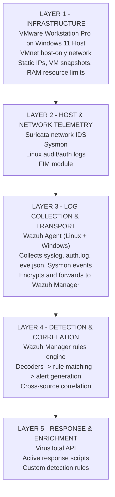
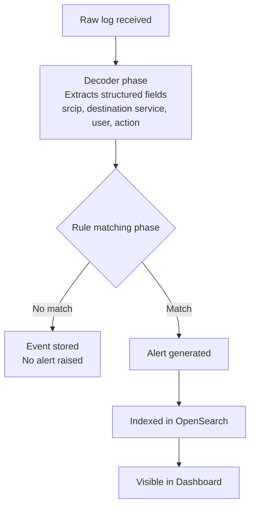
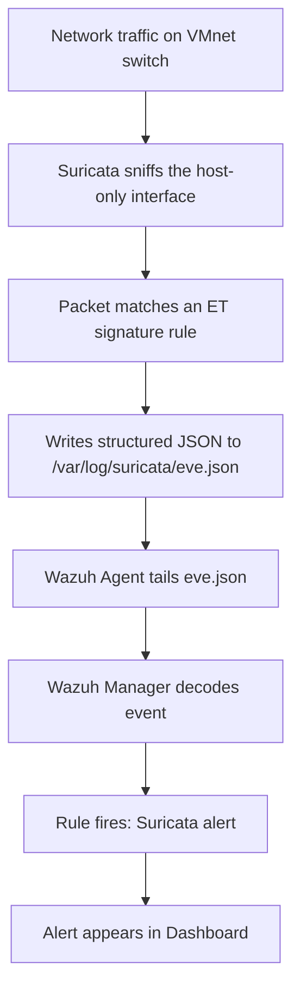
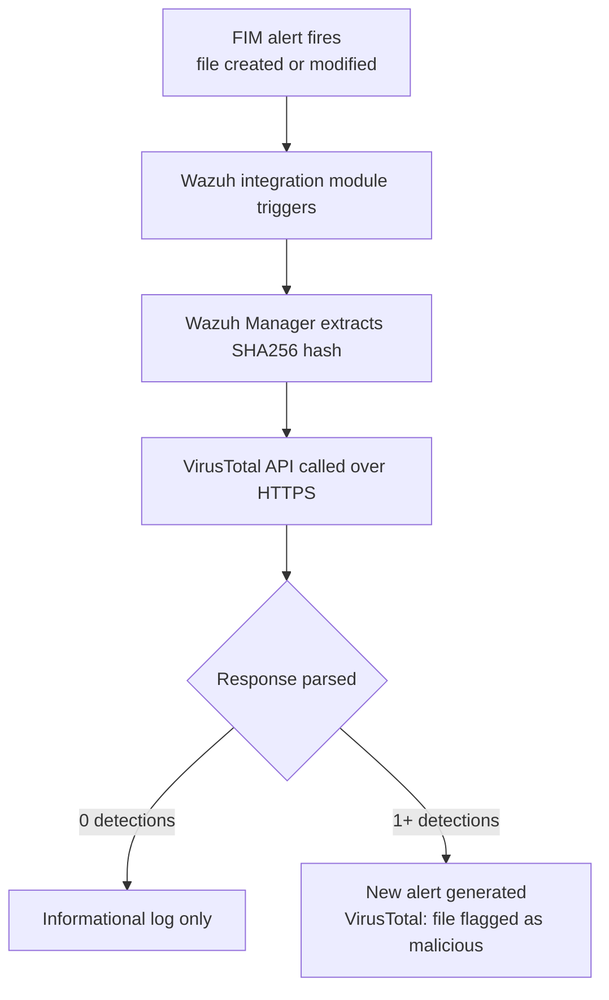
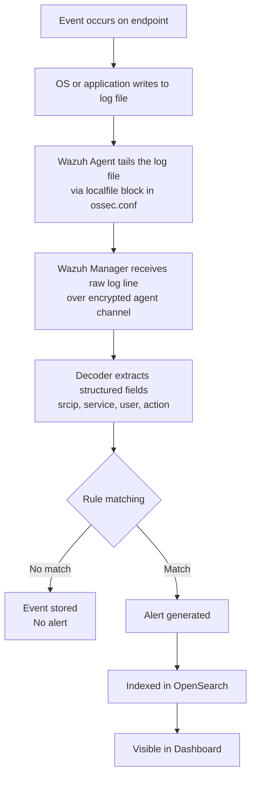
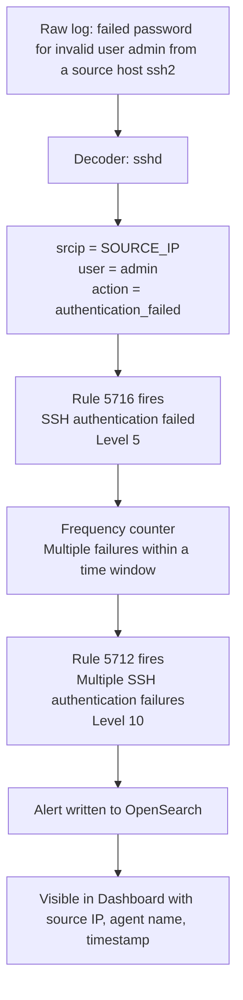
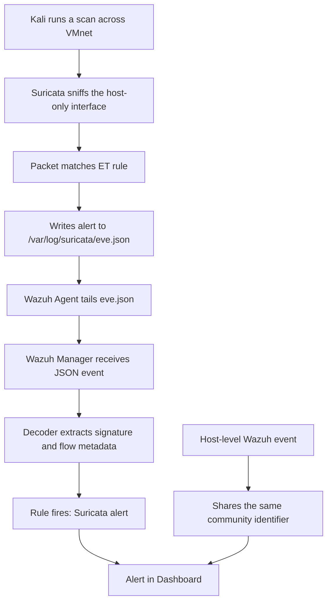
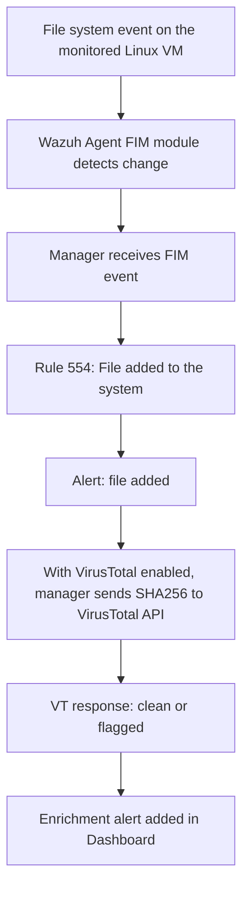
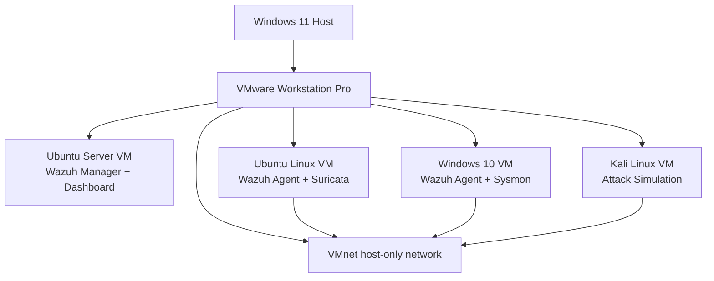

# SOC Home Lab — Components Reference

> **Document type:** Internal technical reference  
> **Audience:** Project owner and technical readers reviewing the GitHub repo  
> **Purpose:** Every component in the lab — what it does, why it's here, how it connects to everything else, and where it sits in the detection stack.

---

## Architecture Overview


The lab is a single-host, multi-VM environment running on Windows 11 via VMware Workstation Pro. All VMs share a virtual network (VMnet). The Ubuntu Server VM is the SIEM core — it receives logs from all enrolled agents, runs detection rules, and surfaces alerts on a web dashboard. The Ubuntu Linux VM is the most data-rich node: it runs both a Wazuh agent and Suricata, which passively sniffs all inter-VM traffic on the shared virtual switch. The Windows 10 VM adds Windows-specific telemetry, with Sysmon installed and integrated. Kali Linux is the red-team node that generates real attack traffic for the detection stack to catch.

---

## Component Inventory

| # | Component | Role | VM / Host |
|---|-----------|------|-----------|
| 1 | VMware Workstation Pro | Hypervisor | Windows 11 Host |
| 2 | Wazuh Manager | SIEM core, rules engine, alert store | Ubuntu Server VM |
| 3 | Wazuh Dashboard | Web UI for alert review | Ubuntu Server VM |
| 4 | Wazuh Agent | Endpoint log collector — Linux | Ubuntu Linux VM |
| 5 | Wazuh Agent | Endpoint log collector — Windows | Windows 10 VM |
| 6 | Suricata | Network traffic analysis, signature matching | Ubuntu Linux VM |
| 7 | Sysmon | Windows process/registry/network telemetry | Windows 10 VM |
| 8 | VirusTotal API | Hash-based threat intelligence enrichment | External (cloud) |
| 9 | Kali Linux | Attack simulation / red-team | Kali Linux VM |

---

## Layer Model

The lab maps cleanly to five layers. Data flows upward (raw events → alerts); detection and response logic flows downward (rules → endpoints).



Each layer is an independent failure domain. If Suricata stops writing to `eve.json` (Layer 2), the Wazuh agent (Layer 3) still forwards all other logs unaffected. This mirrors how real SOC environments are built — sensors, collectors, and the SIEM are always separate.

---

## Component Deep-Dives

### VMware Workstation Pro — Hypervisor

VMware Workstation Pro is the Type-2 hypervisor running directly on the Windows 11 host. It manages all four VMs, their virtual hardware, and the VMnet virtual switch that connects them.

**Why VMware over alternatives:** Better network adapter emulation, and snapshot reliability. VMware's VMnet Host-Only networking creates a proper isolated Layer-2 segment where all VMs can see each other and Suricata can sniff all inter-VM traffic.

**Key config decisions:**

- **Network adapter mode:** VMnet Host-Only — creates an isolated switch; VMs can reach each other but not the external internet directly. Internet access goes through a separate NAT adapter where needed.
- **Ubuntu Linux VM interface:** the host-only capture interface — the interface Suricata binds to for passive traffic capture.
- **RAM strategy:** Only one agent VM runs at a time alongside the Wazuh server and Kali, to avoid thrashing the host. Ubuntu Linux VM and Windows 10 VM are swapped depending on what's being tested.

VMware is the substrate. Every other component runs inside a VM it manages. The VMnet switch it creates is the medium Suricata sniffs.

---

### Wazuh Manager — SIEM Core

The Wazuh Manager is the central brain of the lab. It receives logs from every enrolled agent, runs them through decoders and a rule engine, generates alerts, and stores everything in an OpenSearch index (bundled with Wazuh).

**VM:** Ubuntu Server VM

**Manager communication channels:**

| Channel | Purpose |
|---------|---------|
| Agent log forwarding channel | Receives encrypted endpoint telemetry |
| Agent enrollment channel | Handles registration and key exchange |
| Manager API channel | Serves dashboard and API integrations |
| Dashboard HTTPS channel | Provides secure web access |

**Internal pipeline per log event:**



**Key config file:** `/var/ossec/etc/ossec.conf` on the Ubuntu Server VM.

This is also where the VirusTotal integration block lives, and where active response scripts are declared.

---

### Wazuh Agent — Endpoint Telemetry

A lightweight daemon installed on each monitored endpoint. It tails log files, runs FIM checks, and forwards everything to the Wazuh Manager over an encrypted channel.

**Instances running:**
- Ubuntu Linux VM — enrolled, host-only capture interface
- Windows 10 VM — enrolled, Sysmon integrated

**What each agent collects:**

| Source | Linux Agent | Windows Agent |
|--------|-------------|---------------|
| Auth logs | `/var/log/auth.log` | Windows Security Event Log |
| Syslog | `/var/log/syslog` | System Event Log |
| Suricata alerts | `/var/log/suricata/eve.json` | — |
| FIM monitoring | `/home/<user>` | `C:\Users\` (planned) |
| Sysmon events | — | Microsoft-Windows-Sysmon/Operational |

**Key config file:** `/var/ossec/etc/ossec.conf` on each agent VM — separate from the manager's config file.

**Critical lesson from FIM setup:** The monitored directory rule must exist in both the manager's `ossec.conf` and the agent's `ossec.conf`. Manager-only config silently fails with no errors and no events. Both sides must declare the watched path.

Agent communication: the agent initiates an encrypted connection to the manager. Traffic uses a per-agent key exchanged during registration. The agent sends log batches and heartbeats; the manager sends rule updates and active response commands.

---

### Suricata — Network IDS

Suricata is an open-source network intrusion detection system. It inspects packets on a network interface in real time, matches them against the Emerging Threats community signature set, and writes structured output to `eve.json`.

**Version:** Suricata 7.0.3  
**VM:** Ubuntu Linux VM  
**Interface:** `ens33` — VMware VMnet Host-Only adapter  
**Output:** `/var/log/suricata/eve.json`

**Why Suricata runs on the Ubuntu Linux VM, not a separate VM:**

The Ubuntu Linux VM sits on the VMnet switch with a host-only capture interface that can see all inter-VM traffic. Running Suricata here means it passively sniffs traffic from every VM — Kali's attacks, the Windows 10 VM's responses, the manager's own traffic — without consuming an additional VM slot or requiring extra plumbing. The Wazuh agent is already co-located on the same VM, so `eve.json` gets forwarded through the existing pipeline automatically.

**One Suricata instance covers the whole lab.** No need to install Suricata on every VM.

**How Suricata feeds Wazuh:**



**Community ID:** Enabled (`community-id: true` in `suricata.yaml`). This adds a deterministic hash to every EVE event representing the network flow. When a Suricata network alert and a Wazuh host-level event share the same `community_id`, they can be correlated back to the same TCP/UDP connection during investigation.

**Key config files:**

| File | Purpose |
|------|---------|
| `/etc/suricata/suricata.yaml` | Interface, EVE output, community-id, rule paths |
| `/var/lib/suricata/rules/suricata.rules` | Loaded Emerging Threats community rule set |
| `/var/log/suricata/eve.json` | Structured alert and flow output (read by Wazuh agent) |
| `/var/log/suricata/suricata.log` | Daemon log for troubleshooting |

---

### Sysmon — Windows Telemetry

Sysmon is a Windows system service and kernel driver from Microsoft Sysinternals. It logs process creation, network connections, file activity, DNS queries, and registry changes to the Windows Event Log — things the default Windows Security log completely misses.

**VM:** Windows 10 VM  

**Why Sysmon matters here:** Standard Windows event logging captures logon/logoff and policy changes. It doesn't capture full command-line arguments, parent-child process trees, per-process DNS queries, or DLL loads. Sysmon fills all of those gaps at the kernel level, which is exactly what's needed to detect things like lateral movement, persistence via registry, and malicious child processes.

**Events Sysmon adds:**

| Event ID | What it captures |
|----------|-----------------|
| 1 | Process creation — full command line + parent PID |
| 3 | Network connection — per-process TCP/UDP |
| 7 | Image loaded — DLL loads (detects DLL hijacking) |
| 11 | File created |
| 12 / 13 | Registry key/value created or modified |
| 22 | DNS query |

**Integration path:** Sysmon writes to `Microsoft-Windows-Sysmon/Operational`. The Wazuh agent on the Windows 10 VM reads this channel via an `eventchannel` localfile block in `ossec.conf` and forwards events to the manager. Wazuh ships decoders and rules for all major Sysmon event IDs.

**Config plan:** Uses SwiftOnSecurity's community config to filter noise while keeping high-fidelity events.

---

### VirusTotal — Threat Intelligence

VirusTotal is a cloud-based threat intelligence platform. Its public API takes a file hash (MD5, SHA1, or SHA256) and returns scan results from 70+ antivirus engines.

**Status:** Implemented  
**API tier:** Free public (rate-limited to ~4 requests/minute)

**Integration mechanism:** Wazuh has a built-in VirusTotal module. When a FIM alert fires (file created or modified), Wazuh extracts the SHA256 of the changed file and sends it to the VirusTotal API. The verdict is written back as a new Wazuh alert.

**Why scope it to FIM events initially:** The free tier rate limit makes it impractical to hash every log entry. FIM events on monitored directories are already high-fidelity signals — a new or modified file in the monitored home directory is exactly the kind of artifact an attacker would drop post-exploitation.

**Data flow:**



**Key config:** `<integration>` block in `/var/ossec/etc/ossec.conf` on the manager, with API key and a `rule_id` filter scoped to FIM rules.

---

### Kali Linux — Attack Simulation

Kali is a Debian-based penetration testing distribution used as the red-team node. It sits on the same VMnet switch as everything else, so its traffic is visible to Suricata and its host-level actions are detectable by Wazuh agents on the target VMs.

**VM:** Kali Linux VM

**Attack scenarios used in V1:**

| Feature being tested | Attack from Kali |
|---------------------|-----------------|
| SSH Brute Force Detection | `hydra -l root -P wordlist.txt ssh://[target]` |
| Suricata IDS | `nmap -sS` port scan, Metasploit modules |
| FIM | Drop a file on the target via SCP or reverse shell |
| Malicious Command Detection | Run known-bad patterns — e.g., `nc -e /bin/bash` |
| Custom Rules | Trigger patterns written specifically to match custom Wazuh rules |

Kali's position on the VMnet switch means Suricata sees all its traffic without any additional routing or port mirroring setup.

---

## Data Flows

### Log Ingestion — Baseline Pipeline

This is the path every log event takes, regardless of source.



---

### Alert Generation — Inside the Rule Engine

How a raw SSH log becomes a brute force alert.



---

### Suricata to Wazuh — Correlation Flow

The most complex data path in the lab — crosses two systems before producing an alert.



---

### FIM Event Flow



---

### VirusTotal Enrichment Flow


---

## Component Relationships

How each component relates to every other — what it feeds, what feeds it, and what it runs on.

**VMware Workstation Pro** is the host for every VM. It owns the VMnet virtual switch that all traffic flows through.

**Wazuh Manager** sits at the top of the detection stack. It receives logs from both Wazuh Agents, runs the rule engine, generates alerts, and queries VirusTotal for hash-based enrichment on FIM events. The Dashboard is its UI.

**Wazuh Agent (Ubuntu Linux VM)** feeds the manager. It also reads Suricata's `eve.json`, making it the bridge between the network sensor and the SIEM.

**Wazuh Agent (Windows 10 VM)** feeds the manager. It reads the Sysmon event channel and forwards those enriched Windows events.

**Suricata** is co-located with the Linux Wazuh Agent on the Ubuntu Linux VM. It writes to `eve.json`; the agent reads and forwards it. Suricata's output is its only connection to the rest of the stack — it has no direct link to the manager.

**Sysmon** is co-located with the Windows Wazuh Agent on the Windows 10 VM. It writes to the Windows Event Log; the agent reads the Sysmon channel and forwards events. Same pattern as Suricata.

**VirusTotal** is the only external component. The manager calls out to it over HTTPS; no inbound connection to the lab is required.

**Kali Linux** generates the attack traffic that all detection components are tuned to catch. Its traffic is visible to Suricata on the shared VMnet switch, and its host-level actions on targeted VMs are caught by the Wazuh agents there.

---

## Network Topology



**Why this topology works for Suricata:** In VMware's Host-Only network, all VMs share the same Layer-2 segment (VMnet). Suricata monitors all inter-VM traffic from a single vantage point on the Ubuntu Linux VM. No port mirroring, no dedicated sensor VM needed.

---

## Configuration Files Reference

### Wazuh Manager — Ubuntu Server VM

| File | Purpose |
|------|---------|
| `/var/ossec/etc/ossec.conf` | Global config: agent auth, FIM settings, active response, integrations |
| `/var/ossec/rules/local_rules.xml` | Custom detection rules — never edit built-in rule files |
| `/var/ossec/etc/decoders/local_decoder.xml` | Custom decoders |
| `/var/ossec/logs/ossec.log` | Manager daemon log for troubleshooting |
| `/var/ossec/logs/alerts/alerts.json` | Raw alert output indexed into OpenSearch |

---

### Wazuh Agent — Ubuntu Linux VM

| File | Purpose |
|------|---------|
| `/var/ossec/etc/ossec.conf` | Agent config: localfile entries, FIM directories, manager IP |

`<localfile>` blocks currently configured:

```xml
<!-- Auth log -->
<localfile>
  <log_format>syslog</log_format>
  <location>/var/log/auth.log</location>
</localfile>

<!-- Suricata EVE JSON -->
<localfile>
  <log_format>json</log_format>
  <location>/var/log/suricata/eve.json</location>
</localfile>
```

---

### Suricata — Ubuntu Linux VM

| File | Purpose |
|------|---------|
| `/etc/suricata/suricata.yaml` | Main config: interface, EVE output, community-id, rule paths |
| `/var/lib/suricata/rules/suricata.rules` | Emerging Threats community rule set |
| `/var/log/suricata/eve.json` | Structured alert and flow output — read by Wazuh agent |
| `/var/log/suricata/suricata.log` | Daemon log for troubleshooting |

Critical settings in `suricata.yaml`:

```yaml
af-packet:
      - interface: <host-only-interface>

community-id: true

outputs:
  - eve-log:
      enabled: yes
                  filetype: regular
                  filename: /var/log/suricata/eve.json
      types:
        - alert
        - dns
        - http
        - tls
        - flow
```

---

### Wazuh Agent — Windows 10 VM

| File | Purpose |
|------|---------|
| `C:\Program Files (x86)\ossec-agent\ossec.conf` | Agent config: log channels, FIM paths, manager IP |

Channel block added to ossec.conf:

```xml
<localfile>
  <log_format>eventchannel</log_format>
  <location>Microsoft-Windows-Sysmon/Operational</location>
</localfile>
```

---

## Design Decisions

Every architectural choice in the lab, with the reasoning behind it recorded so it's not lost.

**Run Suricata on the Ubuntu Linux VM, not a dedicated VM**  
Saves a VM slot and RAM. The Ubuntu Linux VM is already on the VMnet switch; the Wazuh agent is already there to forward `eve.json`. No extra plumbing needed. A dedicated IDS VM would add overhead without adding capability in a single-subnet lab.

**One Suricata instance covers the entire lab**  
Running Suricata on every VM would be redundant and wasteful.

**Wazuh as the SIEM**  
Wazuh bundles agent, manager, rule engine, OpenSearch index, and dashboard in a single deployable unit. It's free and open source, maintained actively, ships with 3000+ built-in rules (MITRE ATT&CK mapped), and is designed for exactly this kind of small-scale deployment. Splunk and full ELK require significantly more configuration to reach the same baseline.

**VirusTotal scoped to FIM events initially**  
The free public API is rate-limited to ~4 requests/minute. Sending every log event would immediately exhaust the quota. FIM events are the highest-fidelity trigger for file-based threat intel — a new or modified file in a monitored directory is exactly what post-exploitation file drops look like.

**`community-id: true` in Suricata**  
Deterministic flow hashes let you correlate a Suricata network-layer alert with a Wazuh host-level event that happened on the same TCP/UDP connection. Free to enable. High future value for incident reconstruction.

**FIM directory rule in both manager and agent `ossec.conf`**  
Manager-only config silently fails — no errors, no FIM events. Both the manager's global config and the agent's local config must declare the watched directory. Learned this through debugging during FIM setup.

**TheHive deferred to V2**  
Case management and analyst workflow tooling adds significant deployment complexity. V1 is focused entirely on detection and visibility fundamentals. Once the detection stack is solid, TheHive can layer on top.

**Separate chat per V1 feature**  
Keeps implementation context focused. Each feature has a clean start and end state. Easier to document per-scenario after the fact.

---

*Last updated: V1 complete — FIM, Suricata IDS, SSH Brute Force, VirusTotal, Sysmon all implemented*  
