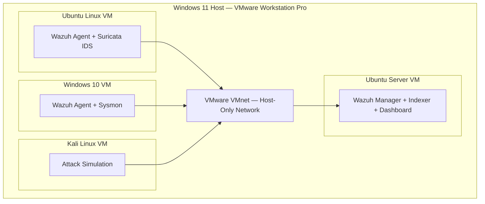

# Lab Setup

This document covers the host environment, VM specifications, roles, and network layout of the SOC home lab.

---

## Host Environment

| Property | Details |
|---|---|
| OS | Windows 11 |
| Hypervisor | VMware Workstation Pro |

---

## Architecture

---

## Virtual Machines

The lab consists of four VMs, each serving a distinct role in the detection pipeline. Due to host RAM constraints, only one agent VM runs at a time alongside the Wazuh server and Kali Linux.

---

### Wazuh Server — Ubuntu Server

| Property | Details |
|---|---|
| OS | Ubuntu Server 22.04 LTS |
| RAM Allocated | 4 GB |
| Role | SIEM Manager + Indexer + Dashboard |

The central brain of the lab. Runs the Wazuh manager, which receives logs forwarded by agents on all other VMs, processes them against detection rules, and surfaces alerts on the Wazuh dashboard. The Wazuh indexer (OpenSearch) and dashboard also run on this VM. All detection logic lives here.

4 GB is the minimum viable allocation — the Wazuh indexer's JVM is memory-hungry and will fail to start below this threshold.

---

### Agent VM — Ubuntu Linux

| Property | Details |
|---|---|
| OS | Ubuntu Linux 22.04 LTS |
| RAM Allocated | 3 GB |
| Role | Wazuh Agent + Suricata IDS |

Serves a dual purpose. The Wazuh agent collects host-level events — file changes, authentication attempts, command execution — and forwards them to the Wazuh server. Suricata runs alongside it in passive sniffing mode, monitoring all inter-VM network traffic on the VMware VMnet switch and writing alerts to `eve.json`, which the Wazuh agent then forwards to the manager.

Suricata is placed on this VM specifically because it sits on the virtual switch shared by all VMs, giving it full visibility into traffic across the entire lab network without needing to be installed on every machine.

Network interface: `ens33` — the VMware VMnet Host-Only adapter Suricata binds to for packet capture.

---

### Windows VM — Windows 10

| Property | Details |
|---|---|
| OS | Windows 10 |
| RAM Allocated | 3 GB |
| Role | Wazuh Agent + Sysmon |

Represents a standard Windows endpoint. Sysmon is installed to enrich Windows event logs with detailed process creation, network connection, and file activity data. The Wazuh agent collects these enriched logs and forwards them to the manager, enabling host-level Windows threat detection.

---

### Attacker VM — Kali Linux

| Property | Details |
|---|---|
| OS | Kali Linux |
| RAM Allocated | 4 GB |
| Role | Attack Simulation |

Used exclusively to simulate attacks against the other VMs — port scans, brute force attempts, malicious payloads. It is the source of all offensive activity in the lab, used to generate real alerts and verify that detections are working as expected. Sits on the same VMnet switch as the defender VMs, so Suricata sees all its traffic without any additional routing or port mirroring.

---

## Network Layout

All VMs are connected on a VMware VMnet Host-Only network, placing them on the same virtual switch while keeping the lab isolated from external networks. This allows inter-VM communication for attack simulation and ensures Suricata can passively sniff all traffic from a single vantage point on the Ubuntu Linux VM.

| VM | Interface | Role on the network |
|---|---|---|
| Ubuntu Server | `ens33` | SIEM — receives agent connections on ports 1514/1515 |
| Ubuntu Linux | `ens33` | Agent + Suricata passive capture |
| Windows 10 | Ethernet | Agent — forwards logs to manager |
| Kali Linux | `eth0` | Attacker — source of all simulated attack traffic |

---

## Data Flow

1. Agent VMs generate events — file changes, network traffic, process activity, Windows logs
2. Wazuh agents on the Ubuntu and Windows VMs forward encrypted logs to the Wazuh manager on port 1514
3. Suricata on the Ubuntu Agent VM sniffs inter-VM traffic on `ens33` and writes structured alerts to `eve.json`
4. The Wazuh agent on the same machine reads `eve.json` and forwards it to the manager
5. The Wazuh manager processes and correlates all incoming data and surfaces alerts on the dashboard
