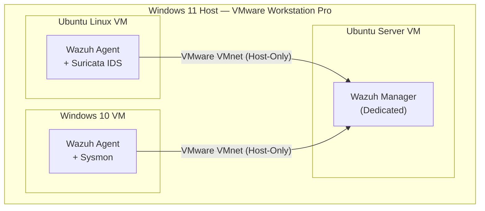
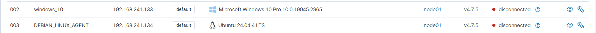

# Wazuh SIEM — Setup & Agent Deployment

## What is Wazuh?

Wazuh is an open-source SIEM (Security Information and Event Management) platform. It collects, normalises, and analyses security events from endpoints across your environment, and surfaces alerts when something looks suspicious or rule-matched. It handles log analysis, file integrity monitoring, intrusion detection, vulnerability scanning, and more — all from a central dashboard.

In this lab, Wazuh acts as the backbone of the SOC: every agent-enrolled VM ships its events back to the Wazuh manager, which correlates and alerts on them.

---

## Lab Architecture



**Key design decision:** Wazuh manager runs on its own dedicated Ubuntu Server VM — not shared with any agent or tool. This mirrors how a real SOC would isolate the SIEM from monitored endpoints.

---

## Wazuh Server Setup (Ubuntu Server VM)

### Why a Dedicated Server VM?

Running Wazuh manager on a separate VM isolates it from the endpoints it monitors. If an agent VM gets "compromised" during attack simulations, the SIEM stays clean. It also reflects real-world SOC architecture where the SIEM is never co-located with monitored hosts.

### VM Specs Used

The Ubuntu Server VM was created in VMware Workstation Pro with the following configuration before Wazuh was touched:

- **OS:** Ubuntu Server 22.04 LTS (no desktop environment — server only)
- **RAM:** 4 GB (Wazuh indexer is memory-hungry; below 4 GB it will struggle to start)
- **Storage:** 50 GB dynamically allocated
- **Network:** VMware VMnet Host-Only (same subnet as all other VMs so agents can reach the manager IP)
- **CPU:** 2 cores minimum

> Ubuntu Server was chosen over Ubuntu Desktop intentionally — no GUI overhead, lower RAM consumption, and closer to how a real SIEM server would be deployed.

---

### Step 1 — Initial OS Prep

Once Ubuntu Server is installed and you've logged in for the first time, do a full system update before installing anything:

```bash
sudo apt-get update && sudo apt-get upgrade -y
```

Set a hostname so the machine is easy to identify when jumping between VMs:

```bash
sudo hostnamectl set-hostname wazuh-server
hostnamectl
```

You should see `Static hostname: wazuh-server` in the output.

---

### Step 2 — Install Required Dependencies

Wazuh's install script handles most dependencies automatically, but `curl` needs to be present to download it:

```bash
sudo apt-get install curl -y
```

---

### Step 3 — Open Required Firewall Ports

If UFW is active on the Ubuntu Server VM, Wazuh's agent communication and dashboard ports need to be opened before installation. Without this, enrolled agents will show as `Never connected` in the dashboard even though the install succeeded.

```bash
# Check if UFW is active
sudo ufw status

# Open required Wazuh ports
sudo ufw allow 1514/tcp    # Agent log forwarding
sudo ufw allow 1515/tcp    # Agent auto-enrollment
sudo ufw allow 443/tcp     # Dashboard HTTPS
sudo ufw allow 55000/tcp   # Wazuh REST API

sudo ufw reload
sudo ufw status
```

| Port | Protocol | Purpose |
|------|----------|---------|
| 1514 | TCP | Agent → Manager: encrypted log forwarding |
| 1515 | TCP | Agent → Manager: auto-enrollment on first start |
| 443  | TCP | Browser → Dashboard: HTTPS web interface |
| 55000 | TCP | Dashboard / API clients → Manager REST API |

---

### Step 4 — Download the Wazuh Installation Script

Wazuh provides an official install assistant script that handles the entire deployment. Check [packages.wazuh.com](https://packages.wazuh.com) for the latest version — the URL below uses 4.7, adjust if a newer release is available:

```bash
curl -sO https://packages.wazuh.com/4.7/wazuh-install.sh
```

Also download the config file the script uses to generate TLS certificates for internal component communication:

```bash
curl -sO https://packages.wazuh.com/4.7/config.yml
```

---

### Step 5 — What Gets Installed (Understanding the Stack)

Running the script with `-a` deploys three components on the same machine:

**Wazuh Manager** — the core engine. Receives events from all enrolled agents, applies detection rules, generates alerts, and writes them to the indexer. This is what the agents talk to over the encrypted agent channel on port 1514.

**Wazuh Indexer** — a modified OpenSearch (fork of Elasticsearch) instance. Stores all the alerts and log data that the manager generates. The dashboard queries this to render what you see on screen. This is the RAM-hungry component — it runs a JVM and needs headroom to load indices.

**Wazuh Dashboard** — a web UI built on OpenSearch Dashboards. This is what you open in a browser to view alerts, agent status, FIM events, etc. Accessed over HTTPS on port 443.

All three talk to each other over localhost when installed on the same machine, so no extra network config is needed between them.

---

### Step 6 — Run the Installer

```bash
sudo bash wazuh-install.sh -a
```

The `-a` flag installs all three components (manager + indexer + dashboard) on this single machine. Right for a home lab — in production these would typically be separated.

The installation takes several minutes. The script will:
1. Generate internal TLS certificates for component-to-component communication
2. Install and configure the Wazuh indexer (OpenSearch)
3. Install and configure the Wazuh manager
4. Install and configure the Wazuh dashboard
5. Start all three services

At the very end, the script prints the dashboard credentials. **These are generated once and not stored anywhere obvious — copy them immediately:**

```
INFO: You can access the web interface https://<your-server-ip>
    User: admin
    Password: <auto-generated-password>
```

> If you miss this output, retrieve the password later with:
> `sudo tar -O -xf wazuh-install-files.tar wazuh-install-files/wazuh-passwords.txt`

<!-- SCREENSHOT: Terminal showing the end of the installer output with the generated admin password -->


---

### Step 7 — Verify All Three Services Are Running

After the install completes, check that all three components started successfully:

```bash
sudo systemctl status wazuh-manager
sudo systemctl status wazuh-indexer
sudo systemctl status wazuh-dashboard
```

Each should show `Active: active (running)`.

> The indexer commonly takes 2–5 minutes longer than the others to fully initialise — it needs to start its JVM and load OpenSearch indices. If it shows `activating` for a while, give it time before assuming something is wrong. If it's still `activating` after 5 minutes, the most likely cause is insufficient RAM (see Troubleshooting below).

To check all three at once:

```bash
sudo systemctl is-active wazuh-manager wazuh-indexer wazuh-dashboard
```

All three should return `active`.

<!-- SCREENSHOT: Terminal showing all three systemctl status outputs with Active: active (running) -->


---

### Step 8 — Get the Server's IP Address

You'll need this IP to configure agents and to access the dashboard from the host browser:

```bash
ip a
```

Look for the IP on the `ens33` interface (VMware VMnet Host-Only) — it'll be in the `192.168.x.x` range.

---

### Step 9 — Access the Dashboard

Open a browser on the **Windows 11 host** (not inside the VM) and navigate to:

```
https://<wazuh-server-vm-ip>
```

Because Wazuh uses a self-signed TLS certificate, the browser will throw a security warning. This is expected — click through it (in Chrome: **Advanced** → **Proceed to...**).

<!-- SCREENSHOT: Browser showing the self-signed cert warning on the Wazuh dashboard URL -->


Log in with:
- **Username:** `admin`
- **Password:** the auto-generated password from Step 6

<!-- SCREENSHOT: Wazuh dashboard login page -->


You'll land on the Wazuh overview dashboard. At this point it shows no agents — the agent enrollment steps below are what populates it.

<!-- SCREENSHOT: Wazuh overview dashboard after first login (no agents yet) -->


---

## Agent Enrollment — Ubuntu Linux VM

This VM runs both the Wazuh agent and Suricata IDS. Network interface is `ens33` on the VMware VMnet Host-Only network.

### Install the Wazuh Agent

```bash
# Add Wazuh repository GPG key
curl -s https://packages.wazuh.com/key/GPG-KEY-WAZUH | sudo gpg --no-default-keyring --keyring gnupg-ring:/usr/share/keyrings/wazuh.gpg --import
sudo chmod 644 /usr/share/keyrings/wazuh.gpg

# Add Wazuh repository
echo "deb [signed-by=/usr/share/keyrings/wazuh.gpg] https://packages.wazuh.com/4.x/apt/ stable main" | sudo tee /etc/apt/sources.list.d/wazuh.list

# Update and install the agent
sudo apt-get update
sudo apt-get install wazuh-agent -y
```

### Configure the Agent to Point at the Manager

Edit the agent config to tell it where the Wazuh manager lives:

```bash
sudo nano /var/ossec/etc/ossec.conf
```

Find the `<client>` block and set the manager IP:

```xml
<client>
  <server>
    <address>192.168.x.x</address>   <!-- Replace with your Wazuh server VM IP -->
    <port>1514</port>
    <protocol>tcp</protocol>
  </server>
</client>
```

Port `1514` is the Wazuh agent log forwarding channel. This is the port agents use to ship encrypted telemetry to the manager.

### Start the Agent (Auto-Enrollment)

In Wazuh 4.x, agents auto-register with the manager on first start via the enrollment service on port `1515` — no manual registration command needed. Simply enable and start the service:

```bash
sudo systemctl daemon-reload
sudo systemctl enable wazuh-agent
sudo systemctl start wazuh-agent

# Confirm it's running
sudo systemctl status wazuh-agent
```

On first start, the agent connects to the manager's enrollment port (1515), receives a unique agent key, and then begins forwarding logs over port 1514. The manager dashboard shows the agent as `Active` within a few seconds.

---

## Agent Enrollment — Windows 10 VM

This VM runs the Wazuh agent alongside Sysmon for enriched Windows telemetry.

### Install via PowerShell (Recommended — run as Administrator)

```powershell
# Download the Wazuh agent MSI (check packages.wazuh.com for the latest version)
Invoke-WebRequest -Uri https://packages.wazuh.com/4.x/windows/wazuh-agent-4.7.3-1.msi -OutFile wazuh-agent.msi

# Install silently, pointing the agent at the manager IP
msiexec.exe /i wazuh-agent.msi /q WAZUH_MANAGER="<wazuh-server-ip>" WAZUH_AGENT_NAME="windows10-vm"
```

### Alternatively — Install via GUI

1. Download `wazuh-agent-4.7.3-1.msi` from [packages.wazuh.com/4.x/windows/](https://packages.wazuh.com/4.x/windows/)
2. Run the installer
3. When prompted, enter the **Wazuh manager IP** in the "Manager IP" field
4. Complete the installation

### Start the Wazuh Agent Service

```powershell
# Start the service
NET START WazuhSvc

# Verify it's running
Get-Service -Name WazuhSvc
```

The agent auto-registers with the manager on first start, same as the Linux agent. No manual key exchange needed.

---

## Verifying Agents Are Connected

Back on the Wazuh dashboard (accessed from the Windows 11 host browser):

1. Navigate to **Agents** in the left sidebar
2. Both enrolled VMs should appear with status **Active**
3. Click into each agent to confirm events are flowing in

<!-- SCREENSHOT: Wazuh Agents page showing both agents (Ubuntu Linux VM and Windows 10 VM) with Active status — this is the key proof-of-work for the entire setup -->


You can also verify from the Wazuh manager CLI on the Ubuntu Server VM:

```bash
sudo /var/ossec/bin/agent_control -l
```

Expected output:

```
Wazuh agent_control. List of available agents:
   ID: 000, Name: wazuh-server, IP: 127.0.0.1, Active/Local
   ID: 001, Name: ubuntu-linux-vm, IP: 192.168.x.x, Active
   ID: 002, Name: windows10-vm,   IP: 192.168.x.x, Active
```

Both agents should show `Active`. If an agent shows `Never connected`, see Troubleshooting below.

---

## Key Config File Locations

| Component | Config File |
|---|---|
| Wazuh Manager | `/var/ossec/etc/ossec.conf` |
| Custom Rules | `/var/ossec/rules/local_rules.xml` |
| Wazuh Agent (Linux) | `/var/ossec/etc/ossec.conf` |
| Wazuh Agent (Windows) | `C:\Program Files (x86)\ossec-agent\ossec.conf` |
| Wazuh Manager Logs | `/var/ossec/logs/ossec.log` |
| Agent Alerts | `/var/ossec/logs/alerts/alerts.json` |

---

## Troubleshooting

### Wazuh Indexer stuck in `activating` after 5+ minutes

The indexer's JVM heap is usually the cause. Check available RAM:

```bash
free -h
```

If free memory is under ~1.5 GB, the indexer can't allocate enough heap to start. On the host, reduce RAM on other running VMs or increase the Ubuntu Server VM's allocation to at least 4 GB.

You can also check the indexer's own log for the actual error:

```bash
sudo journalctl -u wazuh-indexer -n 100 --no-pager
```

---

### Agent shows `Never connected` in the dashboard

This almost always means the agent can't reach the manager on port 1514 or 1515. Work through these in order:

**1 — Confirm the manager IP is correct in the agent config:**

```bash
# On the agent VM
sudo grep -A5 '<server>' /var/ossec/etc/ossec.conf
```

**2 — Test connectivity from the agent VM to the manager:**

```bash
# Test port 1514 (log forwarding)
nc -zv <wazuh-server-ip> 1514

# Test port 1515 (enrollment)
nc -zv <wazuh-server-ip> 1515
```

If these fail, the firewall on the server VM is blocking the ports. Go back to Step 3 and run the UFW rules.

**3 — Check the agent's own log for errors:**

```bash
# Linux agent
sudo tail -f /var/ossec/logs/ossec.log

# Windows agent (PowerShell as Administrator)
Get-Content "C:\Program Files (x86)\ossec-agent\ossec.log" -Tail 50
```

---

### Dashboard loads but shows no alerts after agents connect

The Wazuh indexer may still be initialising its indices. Wait 2–3 minutes after the indexer reaches `active` status, then refresh the dashboard. If the issue persists:

```bash
sudo systemctl restart wazuh-dashboard
```

---

## Notes

- VMware Workstation Pro is the hypervisor for this lab. All VMs share a VMnet Host-Only virtual network — this is what gives agents a routable path to the manager IP and gives Suricata full visibility into inter-VM traffic.
- Only one agent VM runs at a time alongside the Wazuh server and Kali — host RAM constraint on a 16 GB machine. Both agents remain enrolled in Wazuh even when their VM is offline; they show as `Disconnected` rather than disappearing from the agents list.
- The Wazuh indexer (OpenSearch) is the most resource-intensive component. If the host is RAM-constrained, the indexer is the first thing to suffer — monitor its status after any RAM allocation changes.
